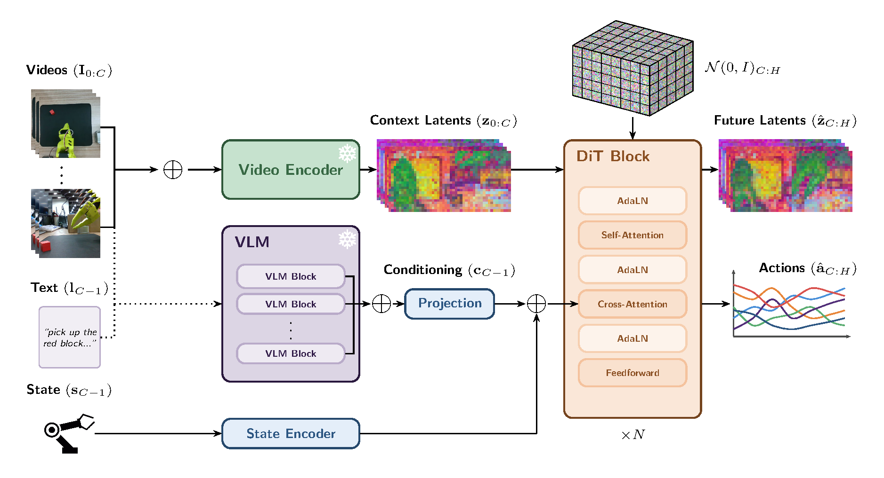

# LeWorldActionModel: JEPA based World Action Model

Experiment adapting [LeWorldModel's](https://arxiv.org/pdf/2603.19312v1) next embedding prediction training objective + SIGReg regularization to train a World Action Model. 
Key difference is that instead of predicting p(zt+1 | zt, at) like in LeWM, I use the IDM objective p(at | zt+1, zt) and the next latent prediction objective: p(zt+1 | zt, zt-1, ...). This allows for the model to be pretrained on non-robotics video data like in DreamZero. 

Architecture not finalized yet. Should I jointly train (at, zt+1 | zt, zt-1, ...) or seperate the training objectives and use teacher forcing? I.e predict future latent, and condition an IDM model on the future and current patch, but then input ground truth next frame sometimes? DreamZero uses joint training,
but training them seperately is more intuitive to me since the training can be more easily seperated. 

Sometimes I can let gradients flow through the encoder, prediction model, and IDM (i.e condition on predicted latent NO teacher forcing)
and then the rest of the time only let gradients flow through the IDM and encoder (WITH teacher forcing), skipping the prediction model
and then in the no actions case (eg. internet video pre training), gradient only flows through encoder and IDM
so there are actually a few potential training objectives that can be used.
(at | z^t+1, zt) NO teacher forcing
(at | zt+1, zt) WITH teacher forcing
(zt+1 | zt, zt-1, ...) Video-only pretrainig

**With action labels:**
```math
L = \underbrace{L_{\text{pred}}(z_{t+1}^{gt}, \hat{z}_{t+1})}_{\text{forward model}} + \underbrace{\lambda_{\text{IDM}} \cdot L_{\text{IDM}}(a_t^{gt}, \hat{a}_t)}_{\text{inverse dynamics}} + \underbrace{\lambda_{\text{SIGReg}} \cdot \text{SIGReg}(Z)}_{\text{anti-collapse}}
```

**Video only:**
```math
L = \underbrace{L_{\text{pred}}(z_{t+1}^{gt}, \hat{z}_{t+1})}_{\text{forward model}} + \underbrace{\lambda_{\text{SIGReg}} \cdot \text{SIGReg}(Z)}_{\text{anti-collapse}}
```



The Latent Predictor is an autoregressive DiT, the IDM is a standard Transformer Decoder.
 
### Pre-trained models
Language encoder (270M params): [T5Gemma-S](https://huggingface.co/google/t5gemma-s-s-prefixlm)

Visual encoder (80M params): [VJEPA2 video encoder](https://github.com/facebookresearch/vjepa2/tree/main?tab=readme-ov-file) (per patch embedding)

### Datasets
[SmolVLA Training Set](https://huggingface.co/datasets/HuggingFaceVLA/community_dataset_v2)

## Model pseudocode
### Inference
```python
context_patch_embeddings = video_encoder(video_context)

language_embedding = null_token
if language_directive:
    language_embedding = language_encoder(language_directive)

predicted_patch_embeddings = latent_predictor(language_embedding, context_frame_embeddings)

if video_only:
    return predicted_patch_embeddings, null #useful for visualizing predicted future states using seperate decoder

state_embedding = state_encoder(state) #proprioceptive state
action_latent_chunk = inverse_dynamics_model(context_patch_embeddings, predicted_frame_embeddings, state_embedding)

action_chunk = action_decoder(action_latent_chunk)
return predicted_patch_embeddings, action_chunk
```

### Training
```python
context_patch_embeddings = video_encoder(video_context)
ground_truth_patch_embeddings = video_encoder(video_ground_truth)

language_embedding = null_token
if language_directive and rand(0,1) > language_dropping_prob:
    language_embedding = language_encoder(language_directive)

predicted_patch_embeddings = latent_predictor(language_embedding, context_patch_embeddings)

if video_only:
    return context_patch_embeddings, ground_truth_patch_embeddings, predicted_patch_embeddings, null

state_embedding = state_encoder(state) #proprioceptive state

if rand(0,1) < teacher_forcing_prob:
    action_latent_chunk = inverse_dynamics_model(context_patch_embeddings, ground_truth_patch_embeddings, state_embedding)
else:
    action_latent_chunk = inverse_dynamics_model(context_patch_embeddings, predicted_patch_embeddings, state_embedding)

action_chunk = action_decoder(action_latent_chunk)
return context_patch_embeddings, ground_truth_patch_embeddings, predicted_patch_embeddings, action_chunk

```
### Loss

```python
context_patch_embeddings, ground_truth_frame_embeddings, predicted_frame_embeddings, action_chunk = model(language_directive, state, video_context)

prediction_loss = ... # Flow matching loss
inverse_dynamics_loss = MSE()
anti_collapse_loss = lambda_SIGReg * SIGReg(patch_embeddings)
```

## Potential future directions / open questions:
- I want to do sequential training, but DreamZero does joint training. Are there benefits to either apporach?
- Can play data / motor babbling be used to actual improve the model or train the IDM? I.E. can we do cross embodiemnt transfer with zero teleoperation?
- how can RL be used to improve the policy after training with IL? Isnt this hard to do with Diffusion models? 
    - Andrew Wagenmaker's work addresses this i think
